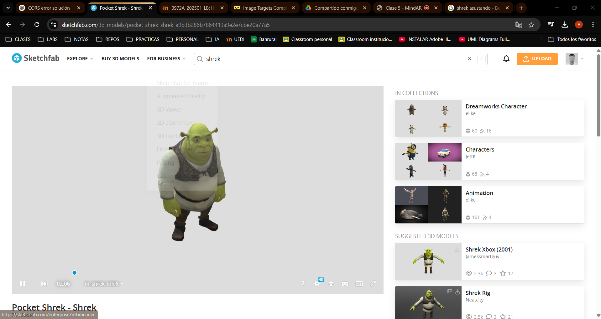
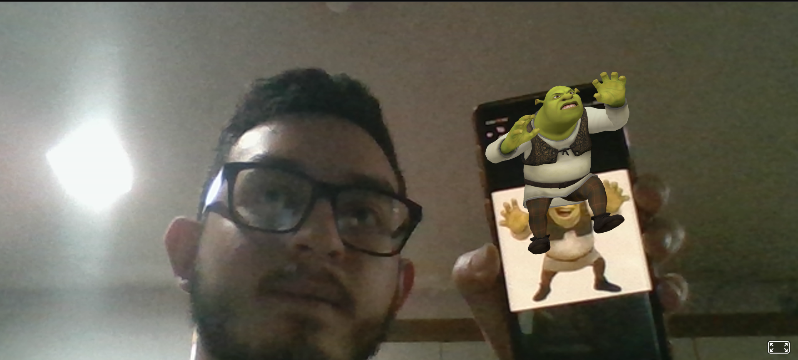

#### Universidad de San Carlos de Guatemala
#### Facultad de Ingeniería
#### Escuela de Ciencias y Sistemas
#### Inteligencia Artificial 1
#### Ing. Luis Espino
#### Auxiliar: Robin Buezo
#### Sección A
       

<strong> HT2: Realidad Aumentada 
</strong>

       

| Nombre                              | Carnet    |
| :---:                               |  :----:   |
| Eduardo Alexander Reyes Gonzalez    | 202010904 |

 

Imagen Compilada:  

 

Pagina de modelos 3d Utilizada: 
https://sketchfab.com/

 
Funcionamiento de la aplicacion

Imagen 1

Imagen 2

