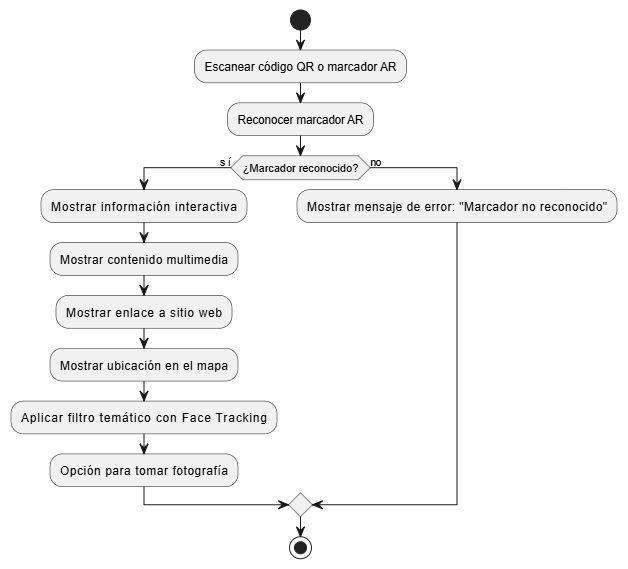

#### Universidad de San Carlos de Guatemala
#### Facultad de Ingeniería
#### Escuela de Ciencias y Sistemas
#### Inteligencia Artificial
#### Ing. LUIS FERNANDO ESPINO BARRIOS
#### Auxiliar: ROBIN OMAR BUEZO DÍAZ
<br><br><br><br><br><br><br>
<p style="text-align: center;"><strong> Proyecto 2: TurisAR <br>
</strong></p>
<br><br><br><br><br><br><br>

| Nombre                              | Carnet    |
| :---:                               |  :----:   |
| Eduardo Alexander Reyes Gonzalez    | 202010904 |
| Pedro Martin Francisco              | 201700656 |
| Luis Antonio Cutzal Chalí           | 201700841 |

# Intrudicción

Este manual tiene como propósito proporcionar una guía completa para la implementación, mantenimiento y expansión de TurisAR, una aplicación web de Realidad Aumentada (AR) diseñada para ofrecer información interactiva sobre los puntos turísticos más importantes, como las 7 maravillas del mundo y las 7 maravillas de Guatemala.

Este manual está dirigido a desarrolladores, administradores del sistema y cualquier persona encargada del mantenimiento o la mejora del proyecto.

# Descripción General del Proyecto
TurisAR es una plataforma interactiva que utiliza la tecnología de Realidad Aumentada para ofrecer a los usuarios información enriquecida sobre los sitios turísticos. A través de su dispositivo móvil, el usuario puede ver información histórica, cultural, multimedia, y más, sobre los puntos de interés al enfocarlos con la cámara. Además, los administradores pueden gestionar los puntos turísticos y su contenido a través de una interfaz web.

# Arquitectura del sistema.


## Módulo de Usuario
Este módulo es responsable de la interacción del usuario con la plataforma. La aplicación usa MindAR y AR.js para integrar Realidad Aumentada en el navegador web y mostrar información relevante sobre los puntos turísticos cuando los usuarios escanean los marcadores AR.
## Módulo Administrativo (Backend):
El módulo administrativo es una interfaz web segura donde los administradores pueden gestionar el contenido de los puntos turísticos. Esto incluye la posibilidad de agregar, editar o eliminar puntos de interés, así como gestionar el contenido multimedia asociado.

# Diagramas de flujo



# Componentes clave
## Módulo de Usuario
- Visualización Interactiva: El usuario puede visualizar información enriquecida sobre los sitios turísticos.
- Filtro Temático y Face Tracking: El sistema incluye filtros temáticos basados en el sitio turístico y permite aplicar Face Tracking a los usuarios.
- Fotografía: El usuario puede tomar fotos mientras usa el filtro temático.
## Módulo Administrativo
- Gestión de Puntos de Interés, los administradores pueden hacer lo siguiente con los puntos turísticos:
    - agregar.
    - editar.
    - eliminar.
- Gestión de Contenido, los administradores gestionan la información multimedia y los enlaces relacionados con los puntos turísticos.

## Requisitos del Sistema
- Sistema Operativo: Compatible con Windows, macOS, y Linux.
- Navegador Web: Google Chrome, Mozilla Firefox, Safari.
- Dispositivo: Smartphone o Tablet con capacidad de usar la cámara y que soporte Realidad Aumentada.
- Conexión a Internet: Necesaria para la descarga de bibliotecas y la carga de recursos multimedia.

## Instalación del Entorno de Desarrollo
- Instalar Node.js
- Clonar el Repositorio de GitHub
- Ejecutar el Proyecto Localmente

```python
python -m http.server 8000
```
- Usa un editor de código que te ayude a escribir, depurar y organizar tu proyecto, como Visual Studio Code (VS Code)

## Estructura de carpetas
- Organiza tu proyecto en carpetas para mantener los archivos ordenados.
```json
│   Admin.html
│   Estudiante.html
│   filtro_tematico.html
│   index.html
│   README.md
├───css
│       admin.css
│       Estudiante.css
│       filtro_tematico.css
│       styles.css
├───deteccion
│       1.chichen.jpg
│       10.livinston.jpg
│       11.chichicastenango.jpg
│       12.semucchampei.jpg
│       13.actunkan.jpg
│       14.mercado_solola.jpg
│       15.craterazul.jpg
│       16.islaflores.jpg
│       17.lagoatitlan.jpg
│       2.machu.jpg
│       3.petra.jpg
│       4.murallachina.jpg
│       5.coliseo.jpg
│       6.talmahal.jpg
│       7.cristoredentos.jpg
│       8.tikal.jpg
│       9.antigua.jpg
│
├───img
├───js
│       admin.js
│       animacion_y_navegacion.js
│       Estudiante.js
│       filtro_tematico.js
│       index.js
├───knowledge_base
│       data.json
├───manuales
│       manual_tecnico.md
│       manual_usuario.md
└───modelos
        2target.mind
        targets.mind
```

#  Mantenimiento y Actualización
## Mantenimiento del Sistema
- Actualización de Contenidos: Los administradores pueden actualizar los datos de los puntos turísticos, incluyendo multimedia, enlaces y más.
- Escalabilidad: La aplicación está diseñada para permitir la adición de nuevos puntos turísticos sin afectar el rendimiento.

# Requerimientos Técnicos y Dependencias
## Tecnologías Utilizadas
- JavaScript: Lenguaje de programación principal para el desarrollo web.
- MindAR: Biblioteca utilizada para implementar la Realidad Aumentada en el navegador.
- AR.js: Biblioteca complementaria para el reconocimiento de marcadores AR.
- GitHub: Usado para control de versiones y gestión del código.

# Proceso de carga
```js
document.getElementById('fileInput').addEventListener('change', function (event) {
    const file = event.target.files[0];
    if (!file) return;
    const reader = new FileReader();
    reader.onload = function (e) {
        try {
            jsonData = e.target.result;
            lista_lugares = JSON.parse(jsonData);
            console.log("EXITO AL CARGAR JSON");
            sessionStorage.setItem("JSON_DATA", jsonData);
            document.getElementById("STATUS_JSON").style.backgroundColor = "green";
            llenarSelectLugares()
        } catch (error) {
            console.log("Error al cargar el JSON: " + error);
        }
    };
    reader.readAsText(file);
});
```

# Guardar en localStorage
```js
function guardarJson() {
    const jsonString = JSON.stringify(lista_lugares, null, 2);
    const blob = new Blob([jsonString], { type: "application/json" });
    const a = document.createElement("a");
    a.href = URL.createObjectURL(blob);
    a.download = "datos.json";
    a.click();
}
```

# Mostrar tablas
En lugar de agregar múltiples archivos HTML, se decidio simplificar la estructura del proyecto ocultando o mostrando los componentes dinámicamente desde el código JavaScript.

```js
function mostrar_tablas(lugar) {
    //IMAGENES
    const divContainer = document.getElementById("conjunto_imagenes");
    divContainer.innerHTML = "";                                //VACIAR DIV
    const tabla = document.createElement("table");
    tabla.style.textAlign = "center";
    tabla.classList.add("tabla_multimedia");
    tabla.innerHTML = `
                <thead>
                    <tr>
                        <th style="font-size: 21px; width: 60%; border: 1px solid black;">Título</th>
                        <th style="font-size: 21px; width: 20%; border: 1px solid black;">Enlace</th>
                        <th style="font-size: 21px; width: 20%; border: 1px solid black;">Acciones</th>
                    </tr>
                </thead>
                <tbody id="tablaBody"></tbody>
            `;
    divContainer.appendChild(tabla); // Agregar la tabla al div

    const tbody = document.getElementById("tablaBody");
    lugar.multimedia[0].forEach((foto, index) => {
        const fila = document.createElement("tr");
        fila.style.height = "40px";
        fila.style.border = "1px solid black";
        fila.innerHTML = `
                    <td style="text-align: left;border: 1px solid black; ">${foto.titulo}</td>
                    <td style="border: 1px solid black;"><a href="${foto.link}" target="_blank">Ver</a></td>
                    <td style="border: 1px solid black;">
                        <button id="boton_tabla_eliminar" onclick="modificar_imagen(${index})">✏️</button>
                        <button onclick="eliminar_imagen(${index})">❌</button>
                    </td>
                `;
        tbody.appendChild(fila);

    });

    //VIDEOS
    const divContainerV = document.getElementById("conjunto_videos");
    divContainerV.innerHTML = "";                                //VACIAR DIV
    const tablaV = document.createElement("table");
    tablaV.style.textAlign = "center";
    tablaV.classList.add("tabla_multimedia");
    tablaV.innerHTML = `
                <thead>
                    <tr>
                        <th style="font-size: 21px; width: 60%; border: 1px solid black;">Título</th>
                        <th style="font-size: 21px; width: 20%; border: 1px solid black;">Enlace</th>
                        <th style="font-size: 21px; width: 20%; border: 1px solid black;">Acciones</th>
                    </tr>
                </thead>
                <tbody id="tablaBodyV"></tbody>
            `;
    divContainerV.appendChild(tablaV); // Agregar la tabla al div

    const tbodyV = document.getElementById("tablaBodyV");
    lugar.multimedia[1].forEach((video, index) => {
        const filav = document.createElement("tr");
        filav.style.height = "40px";
        filav.style.border = "1px solid black";
        filav.innerHTML = `
                    <td style="text-align: left;border: 1px solid black; ">${video.titulo}</td>
                    <td style="border: 1px solid black;"><a href="${video.link}" target="_blank">Ver</a></td>
                    <td style="border: 1px solid black;">
                        <button id="boton_tabla_eliminar" onclick="modificar_video(${index})">✏️</button>
                        <button onclick="eliminar_video(${index})">❌</button>
                    </td>
                `;
        tbodyV.appendChild(filav);

    });
}
```
# Botones
```js
function AccionAtras() {
    document.getElementById("ADMIN_DIV").classList.remove("oculto");
    document.getElementById("EDITAR_AGREGAR").classList.add("oculto");
    document.getElementById("BOTON_ACCION_MODIFICAR").classList.remove("oculto");
    llenarSelectLugares()
}
```

# Estructura del archivo json
```json
[
    {
        "index": 0,
        "nombre_lugar": "Chichen Itza",
        "ubicacion_deteccion": "./deteccion/1.chichen",
        "multimedia": [
            [
                {
                    "titulo": "imagen1",
                    "link": "https://images.unsplash.com/photo-1561577101-aa749bffbb70?q=80&w=2070&auto=format&fit=crop&ixlib=rb-4.0.3&ixid=M3wxMjA3fDB8MHxwaG90by1wYWdlfHx8fGVufDB8fHx8fA%3D%3D"
                },
                {
                    "titulo": "imagen2",
                    "link": "https://plus.unsplash.com/premium_photo-1697730073345-fcb1cdc8334c?q=80&w=1964&auto=format&fit=crop&ixlib=rb-4.0.3&ixid=M3wxMjA3fDB8MHxwaG90by1wYWdlfHx8fGVufDB8fHx8fA%3D%3D"
                },
                {
                    "titulo": "imagen3",
                    "link": "https://plus.unsplash.com/premium_photo-1694475051986-b0384b4205ea?q=80&w=2078&auto=format&fit=crop&ixlib=rb-4.0.3&ixid=M3wxMjA3fDB8MHxwaG90by1wYWdlfHx8fGVufDB8fHx8fA%3D%3D"
                }
            ],
            [
                {
                    "titulo": "video1",
                    "link": "https://videos.pexels.com/video-files/29604765/12740962_640_360_30fps.mp4"
                },
                {
                    "titulo": "video2",
                    "link": "https://videos.pexels.com/video-files/27049872/12057464_2560_1440_60fps.mp4"
                },
                {
                    "titulo": "video3",
                    "link": "https://videos.pexels.com/video-files/18014635/18014635-uhd_2560_1440_30fps.mp4"
                }
            ]
        ],
        "informacion": {
            "nombre": "Chichen Itza",
            "ubicacion": "Yucatan, Mexico",
            "historia": "Fundacion: Chichen Itza fue una ciudad maya fundada alrededor del siglo VI d.C.\n\nDesarrollo: Se convirtio en uno de los centros urbanos mas importantes y prosperos de la civilizacion maya entre los siglos IX y XII, con influencias de otras culturas como la tolteca.\n\nDeclive: La ciudad comenzo a declinar alrededor del siglo XV, y para el siglo XVI ya estaba abandonada, cuando los españoles llegaron a la region.",
            "datos_curiosos": "La piramide de Kukulkan fue diseñada con precision matematica, y los mayas lograron una exactitud increible en su construccion, reflejando un vasto conocimiento de geometria y astronomia.\n\nAunque se desconoce la causa exacta de su declive, algunos expertos sugieren que la llegada de los toltecas, las luchas internas y los cambios climaticos pudieron haber influido."
        },
        "sitio_web": "https://www.chichenitza.com/es",
        "ubicacion": "https://maps.app.goo.gl/jbUdYpMSkBRX84za9",
        "filtro_tematico": "./img/cara.png"
    },
    {
        "index": 1,
        "nombre_lugar": "Machu Picchu",
        "ubicacion_deteccion": "./deteccion/1.chichen",
        "multimedia": [
            [
                {
                    "titulo": "imagen1",
                    "link": "https://plus.unsplash.com/premium_photo-1694475501155-2f344cea9eb3?q=80&w=2069&auto=format&fit=crop&ixlib=rb-4.0.3&ixid=M3wxMjA3fDB8MHxwaG90by1wYWdlfHx8fGVufDB8fHx8fA%3D%3D"
                },
                {
                    "titulo": "imagen2",
                    "link": "https://images.unsplash.com/photo-1567597243073-2d274aabecec?w=500&auto=format&fit=crop&q=60&ixlib=rb-4.0.3&ixid=M3wxMjA3fDB8MHxzZWFyY2h8Nnx8bWFjaHUlMjBwaWNodXxlbnwwfHwwfHx8MA%3D%3D"
                },
                {
                    "titulo": "imagen3",
                    "link": "https://plus.unsplash.com/premium_photo-1694542947671-03a7d921cc85?w=500&auto=format&fit=crop&q=60&ixlib=rb-4.0.3&ixid=M3wxMjA3fDB8MHxzZWFyY2h8OXx8bWFjaHUlMjBwaWNodXxlbnwwfHwwfHx8MA%3D%3D"
                },
                {
                    "titulo": "imagen4",
                    "link": "https://images.unsplash.com/photo-1472982728022-601a8d99e9af?w=500&auto=format&fit=crop&q=60&ixlib=rb-4.0.3&ixid=M3wxMjA3fDB8MHxzZWFyY2h8MTZ8fG1hY2h1JTIwcGljaHV8ZW58MHx8MHx8fDA%3D"
                },
                {
                    "titulo": "imagen5",
                    "link": "https://images.unsplash.com/photo-1615477099823-6495e43ce425?w=500&auto=format&fit=crop&q=60&ixlib=rb-4.0.3&ixid=M3wxMjA3fDB8MHxzZWFyY2h8MTV8fG1hY2h1JTIwcGljaHV8ZW58MHx8MHx8fDA%3D"
                }
            ],
            [
                {
                    "titulo": "video1",
                    "link": "https://videos.pexels.com/video-files/4361882/4361882-sd_640_360_25fps.mp4"
                },
                {
                    "titulo": "video2",
                    "link": "https://videos.pexels.com/video-files/5904599/5904599-sd_360_640_30fps.mp4"
                },
                {
                    "titulo": "video3",
                    "link": "https://videos.pexels.com/video-files/29837362/12813704_640_360_60fps.mp4"
                },
                {
                    "titulo": "video4",
                    "link": "https://videos.pexels.com/video-files/17636428/17636428-sd_640_360_30fps.mp4"
                }
            ]
        ],
        "informacion": {
            "nombre": "Machu Pichu",
            "ubicacion": "Cordillera Oriental del sur de Peru",
            "historia": "Fue construida en el siglo XV por el emperador inca Pachacutec.\n\nSe cree que fue un centro religioso, administrativo y de descanso para la nobleza inca.\n\nFue abandonada en el siglo XVI durante la conquista espanola y redescubierta en 1911 por el explorador Hiram Bingham.",
            "datos_curiosos": "No fue mencionada en los registros coloniales, por lo que los espanoles nunca la encontraron.\n\nSe calcula que aproximadamente 60% de la construccion esta bajo tierra, en forma de cimientos y drenajes.\n\nFue declarada Patrimonio de la Humanidad por la UNESCO en 1983 y una de las 7 maravillas del mundo moderno en 2007."
        },
        "sitio_web": "https://www.perurail.com/es/destinos/machu-picchu/",
        "ubicacion": "https://maps.app.goo.gl/4SUDtg82kTz9ENCE9",
        "filtro_tematico": "./img/cara1.png"
    },
    {
        "index": 2,
        "nombre_lugar": "Petra",
        "ubicacion_deteccion": "./deteccion/1.chichen",
        "multimedia": [
            [
                {
                    "titulo": "imagen1",
                    "link": "https://images.unsplash.com/photo-1606210122158-eeb10e0823bf?w=600&auto=format&fit=crop&q=60&ixlib=rb-4.0.3&ixid=M3wxMjA3fDB8MHxzZWFyY2h8Nnx8UGV0cmF8ZW58MHx8MHx8fDA%3D"
                },
                {
                    "titulo": "imagen2",
                    "link": "https://images.unsplash.com/photo-1563177682-6af44e531038?w=600&auto=format&fit=crop&q=60&ixlib=rb-4.0.3&ixid=M3wxMjA3fDB8MHxzZWFyY2h8MTF8fFBldHJhfGVufDB8fDB8fHww"
                },
                {
                    "titulo": "imagen3",
                    "link": "https://images.unsplash.com/photo-1589825312980-7600c59db1f9?w=600&auto=format&fit=crop&q=60&ixlib=rb-4.0.3&ixid=M3wxMjA3fDB8MHxzZWFyY2h8MTZ8fFBldHJhfGVufDB8fDB8fHww"
                },
                {
                    "titulo": "imagen4",
                    "link": "https://images.unsplash.com/photo-1605647268421-2485f5c61c7f?w=600&auto=format&fit=crop&q=60&ixlib=rb-4.0.3&ixid=M3wxMjA3fDB8MHxzZWFyY2h8MjN8fFBldHJhfGVufDB8fDB8fHww"
                },
                {
                    "titulo": "imagen5",
                    "link": "https://images.unsplash.com/photo-1584830671598-de1eb91c2bb3?w=600&auto=format&fit=crop&q=60&ixlib=rb-4.0.3&ixid=M3wxMjA3fDB8MHxzZWFyY2h8Mzh8fFBldHJhfGVufDB8fDB8fHww"
                }
            ],
            [
                {
                    "titulo": "video1",
                    "link": "https://videos.pexels.com/video-files/4253642/4253642-sd_640_360_25fps.mp4"
                },
                {
                    "titulo": "video2",
                    "link": "https://videos.pexels.com/video-files/5362519/5362519-sd_640_360_25fps.mp4"
                },
                {
                    "titulo": "video3",
                    "link": "https://videos.pexels.com/video-files/30402660/13029663_360_640_30fps.mp4"
                },
                {
                    "titulo": "video4",
                    "link": "https://videos.pexels.com/video-files/4361412/4361412-sd_640_360_25fps.mp4"
                }
            ]
        ],
        "informacion": {
            "nombre": "Petra",
            "ubicacion": "Ma'an, Jordania",
            "historia": "Fundada en el siglo VIII a.C. por los nabateos, Petra fue una importante ciudad comercial. \n\nEs conocida por sus templos y tumbas talladas en roca rosa.",
            "datos_curiosos": "La entrada a la ciudad es un cañon estrecho de 1.2 km llamado 'Siq'.\n\nSu construccion principal, 'El Tesoro', se hizo famosa en la pelicula de Indiana Jones.\n\nEl 85% de la ciudad aun no ha sido excavada."
        },
        "sitio_web": "https://www.visitpetra.jo/en",
        "ubicacion": "https://maps.app.goo.gl/BDbnaPtS83y5917z7",
        "filtro_tematico": "./img/cara2.png"
    },
    {
        "index": 3,
        "nombre_lugar": "Gran Muralla China",
        "ubicacion_deteccion": "./deteccion/1.chichen",
        "multimedia": [
            [
                {
                    "titulo": "imagen1",
                    "link": "https://plus.unsplash.com/premium_photo-1664304492320-8359efcaad38?w=600&auto=format&fit=crop&q=60&ixlib=rb-4.0.3&ixid=M3wxMjA3fDB8MHxzZWFyY2h8MXx8R3JhbiUyME11cmFsbGElMjBDaGluYXxlbnwwfHwwfHx8MA%3D%3D"
                },
                {
                    "titulo": "imagen2",
                    "link": "https://images.unsplash.com/photo-1508804185872-d7badad00f7d?w=600&auto=format&fit=crop&q=60&ixlib=rb-4.0.3&ixid=M3wxMjA3fDB8MHxzZWFyY2h8Mnx8R3JhbiUyME11cmFsbGElMjBDaGluYXxlbnwwfHwwfHx8MA%3D%3D"
                },
                {
                    "titulo": "imagen3",
                    "link": "https://images.unsplash.com/photo-1608037521277-154cd1b89191?w=600&auto=format&fit=crop&q=60&ixlib=rb-4.0.3&ixid=M3wxMjA3fDB8MHxzZWFyY2h8Nnx8R3JhbiUyME11cmFsbGElMjBDaGluYXxlbnwwfHwwfHx8MA%3D%3D"
                },
                {
                    "titulo": "imagen4",
                    "link": "https://images.unsplash.com/flagged/photo-1552553030-837c9c2b0fac?w=600&auto=format&fit=crop&q=60&ixlib=rb-4.0.3&ixid=M3wxMjA3fDB8MHxzZWFyY2h8NHx8R3JhbiUyME11cmFsbGElMjBDaGluYXxlbnwwfHwwfHx8MA%3D%3D"
                },
                {
                    "titulo": "imagen5",
                    "link": "https://plus.unsplash.com/premium_photo-1694475507860-2b9fbdd2de63?w=600&auto=format&fit=crop&q=60&ixlib=rb-4.0.3&ixid=M3wxMjA3fDB8MHxzZWFyY2h8NXx8R3JhbiUyME11cmFsbGElMjBDaGluYXxlbnwwfHwwfHx8MA%3D%3D"
                }
            ],
            [
                {
                    "titulo": "video1",
                    "link": "https://videos.pexels.com/video-files/1193306/1193306-sd_640_360_30fps.mp4"
                },
                {
                    "titulo": "video2",
                    "link": "https://videos.pexels.com/video-files/2881976/2881976-sd_640_360_24fps.mp4"
                },
                {
                    "titulo": "video3",
                    "link": "https://videos.pexels.com/video-files/2881966/2881966-sd_640_360_24fps.mp4"
                },
                {
                    "titulo": "video4",
                    "link": "https://videos.pexels.com/video-files/2882797/2882797-sd_640_360_24fps.mp4"
                },
                {
                    "titulo": "video5",
                    "link": "https://videos.pexels.com/video-files/29540574/12716373_640_360_60fps.mp4"
                }
            ]
        ],
        "informacion": {
            "nombre": "Gran Muralla China",
            "ubicacion": "A lo largo del norte de China",
            "historia": "Construida entre los siglos V a.C. y XVI d.C., la Gran Muralla tenia como proposito proteger a China de invasiones.\n\nMide aproximadamente 21,196 km y fue construida por varias dinastias.",
            "datos_curiosos": "No es visible desde la Luna a simple vista.\n\nSe calcula que mas de un millon de personas trabajaron en su construccion.\n\nFue declarada Patrimonio de la Humanidad en 1987."
        },
        "sitio_web": "https://www.travelchinaguide.com/china_great_wall/",
        "ubicacion": "https://maps.app.goo.gl/Df1pAcDxkDi1BRdJ7",
        "filtro_tematico": "./img/cara3.png"
    },
    {
        "index": 4,
        "nombre_lugar": "Coliseo Romano",
        "ubicacion_deteccion": "./deteccion/1.chichen",
        "multimedia": [
            [
                {
                    "titulo": "imagen1",
                    "link": "https://plus.unsplash.com/premium_photo-1661963952208-2db3512ef3de?w=600&auto=format&fit=crop&q=60&ixlib=rb-4.0.3&ixid=M3wxMjA3fDB8MHxzZWFyY2h8MXx8Q29saXNlbyUyMFJvbWFub3xlbnwwfHwwfHx8MA%3D%3D"
                },
                {
                    "titulo": "imagen2",
                    "link": "https://images.unsplash.com/photo-1552432552-06c0b0a94dda?w=600&auto=format&fit=crop&q=60&ixlib=rb-4.0.3&ixid=M3wxMjA3fDB8MHxzZWFyY2h8Nnx8Q29saXNlbyUyMFJvbWFub3xlbnwwfHwwfHx8MA%3D%3D"
                },
                {
                    "titulo": "imagen3",
                    "link": "https://images.unsplash.com/photo-1515542622106-78bda8ba0e5b?w=600&auto=format&fit=crop&q=60&ixlib=rb-4.0.3&ixid=M3wxMjA3fDB8MHxzZWFyY2h8M3x8Q29saXNlbyUyMFJvbWFub3xlbnwwfHwwfHx8MA%3D%3D"
                },
                {
                    "titulo": "imagen4",
                    "link": "https://plus.unsplash.com/premium_photo-1661902011113-01c962fb2952?w=600&auto=format&fit=crop&q=60&ixlib=rb-4.0.3&ixid=M3wxMjA3fDB8MHxzZWFyY2h8MTN8fENvbGlzZW8lMjBSb21hbm98ZW58MHx8MHx8fDA%3D"
                },
                {
                    "titulo": "imagen5",
                    "link": "https://images.unsplash.com/photo-1579943690410-e7bc21ecf237?w=600&auto=format&fit=crop&q=60&ixlib=rb-4.0.3&ixid=M3wxMjA3fDB8MHxzZWFyY2h8MTl8fENvbGlzZW8lMjBSb21hbm98ZW58MHx8MHx8fDA%3D"
                }
            ],
            [
                {
                    "titulo": "video1",
                    "link": "https://videos.pexels.com/video-files/20606535/20606535-sd_640_360_24fps.mp4"
                },
                {
                    "titulo": "video2",
                    "link": "https://videos.pexels.com/video-files/20606511/20606511-sd_640_360_24fps.mp4"
                },
                {
                    "titulo": "video3",
                    "link": "https://videos.pexels.com/video-files/20438574/20438574-sd_360_640_29fps.mp4"
                },
                {
                    "titulo": "video4",
                    "link": "https://videos.pexels.com/video-files/20606540/20606540-sd_640_360_24fps.mp4"
                },
                {
                    "titulo": "video5",
                    "link": "https://videos.pexels.com/video-files/5087349/5087349-sd_360_640_25fps.mp4"
                }
            ]
        ],
        "informacion": {
            "nombre": "Coliseo Romano",
            "ubicacion": "Centro de Roma, Italia",
            "historia": "Construido en el año 80 d.C. bajo el emperador Tito, el Coliseo Romano era un anfiteatro donde se realizaban combates de gladiadores, caza de animales y espectaculos publicos.",
            "datos_curiosos": "Podia albergar hasta 50,000 espectadores.\n\nPoseia un complejo sistema de tuneles subterraneos para los gladiadores y animales.\n\nHa sobrevivido terremotos y saqueos."
        },
        "sitio_web": "https://parcocolosseo.it/",
        "ubicacion": "https://maps.app.goo.gl/NT9Nt7pWHhuuPMc39",
        "filtro_tematico": "./img/cara4.png"
    },
    {
        "index": 5,
        "nombre_lugar": "Taj Mahal",
        "ubicacion_deteccion": "./deteccion/1.chichen",
        "multimedia": [
            [
                {
                    "titulo": "imagen1",
                    "link": "https://plus.unsplash.com/premium_photo-1661885523029-fc960a2bb4f3?w=600&auto=format&fit=crop&q=60&ixlib=rb-4.0.3&ixid=M3wxMjA3fDB8MHxzZWFyY2h8MXx8VGFqJTIwTWFoYWx8ZW58MHx8MHx8fDA%3D"
                },
                {
                    "titulo": "imagen2",
                    "link": "https://plus.unsplash.com/premium_photo-1661962425238-aeb9b022a94b?w=600&auto=format&fit=crop&q=60&ixlib=rb-4.0.3&ixid=M3wxMjA3fDB8MHxzZWFyY2h8NXx8VGFqJTIwTWFoYWx8ZW58MHx8MHx8fDA%3D"
                },
                {
                    "titulo": "imagen3",
                    "link": "https://images.unsplash.com/photo-1592635196078-9fdc757f27f4?w=600&auto=format&fit=crop&q=60&ixlib=rb-4.0.3&ixid=M3wxMjA3fDB8MHxzZWFyY2h8Nnx8VGFqJTIwTWFoYWx8ZW58MHx8MHx8fDA%3D"
                },
                {
                    "titulo": "imagen4",
                    "link": "https://images.unsplash.com/photo-1587135941948-670b381f08ce?w=600&auto=format&fit=crop&q=60&ixlib=rb-4.0.3&ixid=M3wxMjA3fDB8MHxzZWFyY2h8NHx8VGFqJTIwTWFoYWx8ZW58MHx8MHx8fDA%3D"
                },
                {
                    "titulo": "imagen5",
                    "link": "https://images.unsplash.com/photo-1598324789736-4861f89564a0?w=600&auto=format&fit=crop&q=60&ixlib=rb-4.0.3&ixid=M3wxMjA3fDB8MHxzZWFyY2h8MTR8fFRhaiUyME1haGFsfGVufDB8fDB8fHww"
                },
                {
                    "titulo": "imagen6",
                    "link": "https://images.unsplash.com/photo-1524613032530-449a5d94c285?w=600&auto=format&fit=crop&q=60&ixlib=rb-4.0.3&ixid=M3wxMjA3fDB8MHxzZWFyY2h8MTV8fFRhaiUyME1haGFsfGVufDB8fDB8fHww"
                }
            ],
            [
                {
                    "titulo": "video1",
                    "link": "https://videos.pexels.com/video-files/19717370/19717370-sd_640_360_30fps.mp4"
                },
                {
                    "titulo": "video2",
                    "link": "https://videos.pexels.com/video-files/16577288/16577288-sd_360_640_30fps.mp4"
                },
                {
                    "titulo": "video3",
                    "link": "https://videos.pexels.com/video-files/28240530/12336828_640_360_30fps.mp4"
                },
                {
                    "titulo": "video4",
                    "link": "https://videos.pexels.com/video-files/30061654/12894295_360_640_60fps.mp4"
                },
                {
                    "titulo": "video5",
                    "link": "https://videos.pexels.com/video-files/30061656/12894303_360_640_60fps.mp4"
                },
                {
                    "titulo": "video6",
                    "link": "https://videos.pexels.com/video-files/18517577/18517577-sd_640_360_30fps.mp4"
                },
                {
                    "titulo": "video7",
                    "link": "https://videos.pexels.com/video-files/18286344/18286344-sd_360_640_25fps.mp4"
                }
            ]
        ],
        "informacion": {
            "nombre": "Taj Mahal",
            "ubicacion": "Ciudad de Agra, a orillas del rio Yamuna",
            "historia": "Construido entre 1632 y 1653 por el emperador Shah Jahan en honor a su esposa Mumtaz Mahal, el Taj Mahal es un mausoleo de marmol blanco con incrustaciones de piedras preciosas.",
            "datos_curiosos":"Cambia de color segun la luz del dia.\n\nSe necesitaron mas de 20,000 obreros para su construccion.\n\nEs un simbolo del amor eterno."
        },
        "sitio_web": "https://www.tajmahal.gov.in/",
        "ubicacion": "https://maps.app.goo.gl/mvFrvSZshRoDpJ7z8",
        "filtro_tematico": "./img/cara5.png"
    },
    {
        "index": 6,
        "nombre_lugar": "Cristo Redentor",
        "ubicacion_deteccion": "./deteccion/1.chichen",
        "multimedia": [
            [
                {
                    "titulo": "imagen1",
                    "link": "https://images.unsplash.com/photo-1593995863951-57c27e518295?w=600&auto=format&fit=crop&q=60&ixlib=rb-4.0.3&ixid=M3wxMjA3fDB8MHxzZWFyY2h8Mnx8Q3Jpc3RvJTIwUmVkZW50b3J8ZW58MHx8MHx8fDA%3D"
                },
                {
                    "titulo": "imagen2",
                    "link": "https://images.unsplash.com/photo-1564659907532-6b5f98c8e70f?w=600&auto=format&fit=crop&q=60&ixlib=rb-4.0.3&ixid=M3wxMjA3fDB8MHxzZWFyY2h8M3x8Q3Jpc3RvJTIwUmVkZW50b3J8ZW58MHx8MHx8fDA%3D"
                },
                {
                    "titulo": "imagen3",
                    "link": "https://images.unsplash.com/photo-1516834611397-8d633eaec5d0?w=600&auto=format&fit=crop&q=60&ixlib=rb-4.0.3&ixid=M3wxMjA3fDB8MHxzZWFyY2h8OHx8Q3Jpc3RvJTIwUmVkZW50b3J8ZW58MHx8MHx8fDA%3D"
                },
                {
                    "titulo": "imagen4",
                    "link": "https://images.unsplash.com/photo-1539053447282-6f32f2bddfed?w=600&auto=format&fit=crop&q=60&ixlib=rb-4.0.3&ixid=M3wxMjA3fDB8MHxzZWFyY2h8MTB8fENyaXN0byUyMFJlZGVudG9yfGVufDB8fDB8fHww"
                },
                {
                    "titulo": "imagen5",
                    "link": "https://images.unsplash.com/photo-1483729558449-99ef09a8c325?w=600&auto=format&fit=crop&q=60&ixlib=rb-4.0.3&ixid=M3wxMjA3fDB8MHxzZWFyY2h8MTF8fENyaXN0byUyMFJlZGVudG9yJTIwcmlvJTIwZGUlMjBqYW5laXJvfGVufDB8fDB8fHww"
                },
                {
                    "titulo": "imagen6",
                    "link": "https://images.unsplash.com/photo-1655642272518-05aaf7b8726e?w=600&auto=format&fit=crop&q=60&ixlib=rb-4.0.3&ixid=M3wxMjA3fDB8MHxzZWFyY2h8Mzh8fENyaXN0byUyMFJlZGVudG9yfGVufDB8fDB8fHww"
                }
            ],
            [
                {
                    "titulo": "video1",
                    "link": "https://videos.pexels.com/video-files/2829276/2829276-sd_360_640_24fps.mp4"
                },
                {
                    "titulo": "video2",
                    "link": "https://videos.pexels.com/video-files/27516120/12157119_360_640_60fps.mp4"
                },
                {
                    "titulo": "video3",
                    "link": "https://videos.pexels.com/video-files/27516120/12157119_360_640_60fps.mp4"
                },
                {
                    "titulo": "video4",
                    "link": "https://videos.pexels.com/video-files/27516126/12157147_360_640_60fps.mp4"
                },
                {
                    "titulo": "video5",
                    "link": "https://videos.pexels.com/video-files/4902988/4902988-sd_640_360_25fps.mp4"
                },
                {
                    "titulo": "video6",
                    "link": "https://videos.pexels.com/video-files/20276559/20276559-sd_640_360_30fps.mp4"
                }
            ]
        ],
        "informacion": {
            "nombre": "Cristo Redentor",
            "ubicacion": "Cerro del Corcovado, Rio de Janeiro",
            "historia": "Inaugurado en 1931, el Cristo Redentor es una estatua de 30 metros de altura situada en la cima del cerro Corcovado en Rio de Janeiro.\n\nFue diseñado por el ingeniero Heitor da Silva Costa y el escultor frances Paul Landowski.",
            "datos_curiosos": "Esta hecho de hormigon armado y piedra jabon.\n\nFue construido en Francia y ensamblado en Brasil.\n\nSu mirador ofrece una vista panoramica de Rio de Janeiro."
        },
        "sitio_web": "https://santuariocristoredentor.com.br/",
        "ubicacion": "https://maps.app.goo.gl/pP8CpnmUni2xAbGv9",
        "filtro_tematico": "./img/cara6.png"
    },
    {
        "index": 7,
        "nombre_lugar": "Parque Nacional Tikal",
        "ubicacion_deteccion": "./deteccion/1.chichen",
        "multimedia": [
            [
                {
                    "titulo": "img1",
                    "link": "https://images.unsplash.com/photo-1508035460735-91088c495500?w=600&auto=format&fit=crop&q=60&ixlib=rb-4.0.3&ixid=M3wxMjA3fDB8MHxzZWFyY2h8Mnx8VGlrYWx8ZW58MHx8MHx8fDA%3D"
                },
                {
                    "titulo": "img2",
                    "link": "https://images.unsplash.com/photo-1600207882264-605cd561ce4a?w=600&auto=format&fit=crop&q=60&ixlib=rb-4.0.3&ixid=M3wxMjA3fDB8MHxzZWFyY2h8NHx8VGlrYWx8ZW58MHx8MHx8fDA%3D"
                },
                {
                    "titulo": "img3",
                    "link": "https://images.unsplash.com/photo-1593052135997-ea813aeb2a69?w=600&auto=format&fit=crop&q=60&ixlib=rb-4.0.3&ixid=M3wxMjA3fDB8MHxzZWFyY2h8OHx8VGlrYWx8ZW58MHx8MHx8fDA%3D"
                },
                {
                    "titulo": "img4",
                    "link": "https://images.unsplash.com/photo-1634842557213-0985d39cd1a6?w=600&auto=format&fit=crop&q=60&ixlib=rb-4.0.3&ixid=M3wxMjA3fDB8MHxzZWFyY2h8MTF8fFRpa2FsfGVufDB8fDB8fHww"
                },
                {
                    "titulo": "img5",
                    "link": "https://images.unsplash.com/photo-1540858486584-5b4f72a83d99?w=600&auto=format&fit=crop&q=60&ixlib=rb-4.0.3&ixid=M3wxMjA3fDB8MHxzZWFyY2h8MTV8fFRpa2FsfGVufDB8fDB8fHww"
                }
            ],
            [
                {
                    "titulo": "video1",
                    "link": "https://videos.pexels.com/video-files/29721175/12778894_640_360_60fps.mp4"
                },
                {
                    "titulo": "video2",
                    "link": "https://videos.pexels.com/video-files/29721176/12778900_640_360_60fps.mp4"
                },
                {
                    "titulo": "video3",
                    "link": "https://videos.pexels.com/video-files/16416573/16416573-sd_640_360_30fps.mp4"
                },
                {
                    "titulo": "video4",
                    "link": "https://videos.pexels.com/video-files/16416574/16416574-sd_640_360_30fps.mp4"
                },
                {
                    "titulo": "video5",
                    "link": "https://videos.pexels.com/video-files/16706270/16706270-sd_640_360_30fps.mp4"
                }
            ]
        ],
        "informacion": {
            "nombre": "Parque Nacional Tikal",
            "ubicacion": "Peten, Guatemala",
            "historia": "Tikal es uno de los sitios arqueologicos mayas mas importantes del mundo. Fue una de las ciudades mas influyentes de la civilizacion maya, alcanzando su apogeo entre los siglos VI y IX d.C. Sus ruinas incluyen templos impresionantes, plazas y complejos palaciegos.",
            "datos_curiosos": "Tikal fue declarado Patrimonio de la Humanidad por la UNESCO en 1979.\n\nSus piramides superan los 60 metros de altura.\n\nEs hogar de una gran diversidad de flora y fauna, incluyendo jaguares y tucanes."
        },
        "sitio_web": "https://tikalnationalpark.org/",
        "ubicacion": "https://maps.app.goo.gl/JUhhWskgprubsEzK9",
        "filtro_tematico": "./img/cara7.png"
    },
    {
        "index": 8,
        "nombre_lugar": "Antigua Guatemala",
        "ubicacion_deteccion": "./deteccion/1.chichen",
        "multimedia": [
            [
                {
                    "titulo": "img1",
                    "link": "https://plus.unsplash.com/premium_photo-1680100349214-45e2685d4746?w=600&auto=format&fit=crop&q=60&ixlib=rb-4.0.3&ixid=M3wxMjA3fDB8MHxzZWFyY2h8MXx8QW50aWd1YSUyMEd1YXRlbWFsYXxlbnwwfHwwfHx8MA%3D%3D"
                },
                {
                    "titulo": "img2",
                    "link": "https://images.unsplash.com/photo-1589783500222-4529ddfd87d1?w=600&auto=format&fit=crop&q=60&ixlib=rb-4.0.3&ixid=M3wxMjA3fDB8MHxzZWFyY2h8Mnx8QW50aWd1YSUyMEd1YXRlbWFsYXxlbnwwfHwwfHx8MA%3D%3D"
                },
                {
                    "titulo": "img3",
                    "link": "https://images.unsplash.com/photo-1628128594359-25d5e30661dd?w=600&auto=format&fit=crop&q=60&ixlib=rb-4.0.3&ixid=M3wxMjA3fDB8MHxzZWFyY2h8NHx8QW50aWd1YSUyMEd1YXRlbWFsYXxlbnwwfHwwfHx8MA%3D%3D"
                },
                {
                    "titulo": "img4",
                    "link": "https://images.unsplash.com/photo-1573506858340-63218d518428?w=600&auto=format&fit=crop&q=60&ixlib=rb-4.0.3&ixid=M3wxMjA3fDB8MHxzZWFyY2h8Nnx8QW50aWd1YSUyMEd1YXRlbWFsYXxlbnwwfHwwfHx8MA%3D%3D"
                },
                {
                    "titulo": "img5",
                    "link": "https://images.unsplash.com/photo-1602120012884-6aa678fa79c7?w=600&auto=format&fit=crop&q=60&ixlib=rb-4.0.3&ixid=M3wxMjA3fDB8MHxzZWFyY2h8MTB8fEFudGlndWElMjBHdWF0ZW1hbGF8ZW58MHx8MHx8fDA%3D"
                }
            ],
            [
                {
                    "titulo": "video1",
                    "link": "https://videos.pexels.com/video-files/17658222/17658222-sd_640_360_30fps.mp4"
                },
                {
                    "titulo": "video2",
                    "link": "https://videos.pexels.com/video-files/17658223/17658223-sd_640_360_30fps.mp4"
                },
                {
                    "titulo": "video3",
                    "link": "https://videos.pexels.com/video-files/12901766/12901766-sd_640_360_24fps.mp4"
                }
            ]
        ],
        "informacion": {
            "nombre": "Antigua Guatemala",
            "ubicacion": "Sacatepequez, Guatemala",
            "historia": "Antigua Guatemala fue la capital del Reino de Guatemala hasta 1776. \n\nEs famosa por su arquitectura colonial y sus calles empedradas. \n\nLa ciudad ha sido reconstruida tras multiples terremotos y es un importante destino turistico.",
            "datos_curiosos": "Fue declarada Patrimonio de la Humanidad por la UNESCO en 1979.\n\nDurante la Semana Santa, sus procesiones y alfombras de aserrin son mundialmente famosas.\n\nEsta rodeada por tres volcanes: Agua, Fuego y Acatenango."
        },
        "sitio_web": "https://laantiguaguatemala.org/",
        "ubicacion": "https://maps.app.goo.gl/1vLuLAif9auqQfYG8",
        "filtro_tematico": "./img/cara8.png"
    },
    {
        "index": 9,
        "nombre_lugar": "Livingston",
        "ubicacion_deteccion": "./deteccion/1.chichen",
        "multimedia":[
            [
                {
                    "titulo": "img1",
                    "link": "https://plus.unsplash.com/premium_photo-1697730225889-8d7fccad86a2?w=500&auto=format&fit=crop&q=60&ixlib=rb-4.0.3&ixid=M3wxMjA3fDB8MHxzZWFyY2h8MXx8R3VhdGVtYWxhJTIwbGl2aW5nc3RvbnxlbnwwfHwwfHx8MA%3D%3D"
                },
                {
                    "titulo": "img2",
                    "link": "https://images.unsplash.com/photo-1540857650430-e405679aa267?w=500&auto=format&fit=crop&q=60&ixlib=rb-4.0.3&ixid=M3wxMjA3fDB8MHxzZWFyY2h8MzB8fGxpdmluZ3N0b24lMjBndWF0ZW1hbGF8ZW58MHx8MHx8fDA%3D"
                },
                {
                    "titulo": "img3",
                    "link": "https://images.unsplash.com/photo-1593453758793-bd3f9b6c0bc4?w=500&auto=format&fit=crop&q=60&ixlib=rb-4.0.3&ixid=M3wxMjA3fDB8MHxzZWFyY2h8MTh8fGxpdmluZ3N0b24lMjBndWF0ZW1hbGF8ZW58MHx8MHx8fDA%3D"
                },
                {
                    "titulo": "img4",
                    "link": "https://plus.unsplash.com/premium_photo-1711255562146-0acdc7d5c659?w=500&auto=format&fit=crop&q=60&ixlib=rb-4.0.3&ixid=M3wxMjA3fDB8MHxzZWFyY2h8NXx8R3VhdGVtYWxhJTIwTGl2aW5nc3RvbnxlbnwwfHwwfHx8MA%3D%3D"
                },
                {
                    "titulo": "img5",
                    "link": "https://media.istockphoto.com/id/862172056/es/foto/r%C3%ADo-de-livingston-y-r%C3%ADo-dulce-guatemala.webp?a=1&b=1&s=612x612&w=0&k=20&c=ALfMr6Z9vnlAI5i9ixjzOczJG0VLC6tur6P4WYcXYAE="
                }
            ],
            [
                {
                    "titulo": "video1",
                    "link": "https://videos.pexels.com/video-files/13581371/13581371-sd_640_360_24fps.mp4"
                },
                {
                    "titulo": "video2",
                    "link": "https://videos.pexels.com/video-files/16678827/16678827-sd_640_360_30fps.mp4"
                },
                {
                    "titulo": "video3",
                    "link": "https://videos.pexels.com/video-files/20218101/20218101-hd_1920_1080_30fps.mp4"
                }
            ]
        ],
        "informacion": {
            "nombre": "Livingston",
            "ubicacion": "Izabal, Guatemala",
            "historia": "Livingston es un pueblo costero con una rica herencia garifuna. \n\nSe destaca por su mezcla de culturas afrocaribeña, maya y ladina, y es accesible unicamente por barco desde Rio Dulce o Puerto Barrios.",
            "datos_curiosos": "Livingston es famoso por su platillo tradicional, el Tapado, un caldo de mariscos con coco.\n\nLa cultura garifuna en Livingston fue declarada Patrimonio Cultural Inmaterial de la Humanidad por la UNESCO.\n\nEs el punto de partida hacia Playa Blanca y los Siete Altares, dos destinos turisticos populares."
        },
        "sitio_web": "https://munilivingston.gob.gt/",
        "ubicacion": "https://maps.app.goo.gl/tiXMEfbHine5ejtB6",
        "filtro_tematico": "./img/cara.png"
    },
    {
        "index": 10,
        "nombre_lugar": "Chichicastenango y su mercado",
        "ubicacion_deteccion": "./deteccion/1.chichen",
        "multimedia": [
            [
                {
                    "titulo": "img1",
                    "link": "https://plus.unsplash.com/premium_photo-1697730225889-8d7fccad86a2?w=500&auto=format&fit=crop&q=60&ixlib=rb-4.0.3&ixid=M3wxMjA3fDB8MHxzZWFyY2h8MXx8Q2hpY2hpY2FzdGVuYW5nbyUyMHklMjBzdSUyMG1lcmNhZG98ZW58MHx8MHx8fDA%3D"
                },
                {
                    "titulo": "img2",
                    "link": "https://images.unsplash.com/photo-1488459716781-31db52582fe9?w=500&auto=format&fit=crop&q=60&ixlib=rb-4.0.3&ixid=M3wxMjA3fDB8MHxzZWFyY2h8M3x8Q2hpY2hpY2FzdGVuYW5nbyUyMHklMjBzdSUyMG1lcmNhZG98ZW58MHx8MHx8fDA%3D"
                },
                {
                    "titulo": "img3",
                    "link": "https://plus.unsplash.com/premium_photo-1697730225889-8d7fccad86a2?w=500&auto=format&fit=crop&q=60&ixlib=rb-4.0.3&ixid=M3wxMjA3fDB8MHxzZWFyY2h8MXx8Q2hpY2hpY2FzdGVuYW5nbyUyMHklMjBzdSUyMG1lcmNhZG98ZW58MHx8MHx8fDA%3D"
                },
                {
                    "titulo": "img4",
                    "link": "https://images.unsplash.com/photo-1554486855-60050042cd53?w=500&auto=format&fit=crop&q=60&ixlib=rb-4.0.3&ixid=M3wxMjA3fDB8MHxzZWFyY2h8MjB8fENoaWNoaWNhc3RlbmFuZ28lMjB5JTIwc3UlMjBtZXJjYWRvfGVufDB8fDB8fHww"
                },
                {
                    "titulo": "img5",
                    "link": "https://images.unsplash.com/photo-1509813685-e7f0e4eaf3ee?w=500&auto=format&fit=crop&q=60&ixlib=rb-4.0.3&ixid=M3wxMjA3fDB8MHxzZWFyY2h8MTl8fENoaWNoaWNhc3RlbmFuZ28lMjB5JTIwc3UlMjBtZXJjYWRvfGVufDB8fDB8fHww"
                }
            ],
            [
                {
                    "titulo": "video1",
                    "link": "https://files.catbox.moe/z2fhh1.mp4"
                }
            ]
        ],
        "informacion": {
            "nombre": "Chichicastenango y su mercado",
            "ubicacion": "Quiche, Guatemala",
            "historia": "Chichicastenango es famoso por su mercado indigena, donde los comerciantes mayas venden textiles, artesanias y productos agricolas.\n\nTambien es hogar de la Iglesia de Santo Tomas, donde se mezclan creencias catolicas y mayas.",
            "datos_curiosos": "El mercado se celebra los jueves y domingos.\n\nEl Popol Vuh, el libro sagrado de los mayas, fue descubierto en Chichicastenango.\n\nLos rituales mayas todavia se practican en la Iglesia de Santo Tomas."
        },
        "sitio_web": "https://www.visitcentroamerica.com/visitar/iglesia-santo-tomas-cerro-pascual-abaj-mercado-chichicastenango/",
        "ubicacion": "https://maps.app.goo.gl/CpGwgSxoqK2b8hBw6",
        "filtro_tematico": "./img/cara.png"
    },
    {
        "index": 11,
        "nombre_lugar": "Semuc Champey",
        "ubicacion_deteccion": "./deteccion/1.chichen",
        "multimedia": [
            [
                {
                    "titulo": "img1",
                    "link": "https://images.unsplash.com/photo-1675185457371-aae4e3ea0270?w=500&auto=format&fit=crop&q=60&ixlib=rb-4.0.3&ixid=M3wxMjA3fDB8MHxzZWFyY2h8NHx8U2VtdWMlMjBDaGFtcGV5fGVufDB8fDB8fHww"
                },
                {
                    "titulo": "img2",
                    "link": "https://images.unsplash.com/photo-1684861999737-bdb269a4f0b9?w=500&auto=format&fit=crop&q=60&ixlib=rb-4.0.3&ixid=M3wxMjA3fDB8MHxzZWFyY2h8Mnx8U2VtdWMlMjBDaGFtcGV5fGVufDB8fDB8fHww"
                },
                {
                    "titulo": "img3",
                    "link": "https://images.unsplash.com/photo-1678997823503-b004cddec120?w=500&auto=format&fit=crop&q=60&ixlib=rb-4.0.3&ixid=M3wxMjA3fDB8MHxzZWFyY2h8M3x8U2VtdWMlMjBDaGFtcGV5fGVufDB8fDB8fHww"
                },
                {
                    "titulo": "img4",
                    "link": "https://images.unsplash.com/photo-1544646280-7ddec974a44e?w=500&auto=format&fit=crop&q=60&ixlib=rb-4.0.3&ixid=M3wxMjA3fDB8MHxzZWFyY2h8MTF8fFNlbXVjJTIwQ2hhbXBleXxlbnwwfHwwfHx8MA%3D%3D"
                },
                {
                    "titulo": "img5",
                    "link": "https://media.istockphoto.com/id/2187894388/photo/semuc-champey-guatemala.jpg?s=2048x2048&w=is&k=20&c=DKxQyZ0OyfQXNYddt3mxW56e_QQFqHcaV4irjMlJCMQ="
                }
            ],
            [
                {
                    "titulo": "video1",
                    "link": "https://files.catbox.moe/taynjs.mp4"
                }
            ]
        ],
        "informacion": {
            "nombre": "Semuc Champey",
            "ubicacion": "Alta Verapaz, Guatemala",
            "historia": "Semuc Champey es un paraiso natural con pozas de agua turquesa formadas sobre un puente de piedra caliza.\n\nEs un destino popular para nadar, hacer senderismo y explorar cuevas.",
            "datos_curiosos": "El agua cristalina de las pozas proviene del rio Cahabon.\n\nEl mirador de Semuc Champey ofrece una vista panoramica impresionante.\n\nPara llegar, se necesita un viaje en 4x4 por caminos montañosos."
        },
        "sitio_web": "https://www.tripadvisor.es/Attraction_Review-g303868-d600477-Reviews-Semuc_Champey-Lanquin_Alta_Verapaz_Department.html",
        "ubicacion": "https://maps.app.goo.gl/5W3M7hASPfRn6chQ8",
        "filtro_tematico": "./img/cara.png"
    },
    {
        "index": 12,
        "nombre_lugar": "Las cuevas de Actun Kan",
        "ubicacion_deteccion": "./deteccion/1.chichen",
        "multimedia": [
            [
                {
                    "titulo": "img1",
                    "link": "https://marketingsimulator.net/wilmerarias/wp-content/uploads/sites/466/2017/02/Aktun-can-672x296.jpg"
                },
                {
                    "titulo": "img2",
                    "link": "https://aprende.guatemala.com/wp-content/uploads/2017/05/Cuevas-de-Act%C3%BAn-Kan-en-Pet%C3%A9n.jpg"
                },
                {
                    "titulo": "img3",
                    "link": "https://1.bp.blogspot.com/-GbP2Iqy1C9w/U5jzAkyc0vI/AAAAAAAAACI/9J2Cod7nNdE/s1600/5..jpg"
                },
                {
                    "titulo": "img4",
                    "link": "https://external-content.duckduckgo.com/iu/?u=https%3A%2F%2Fsnorkeladw.com%2Fwp-content%2Fuploads%2Felementor%2Fthumbs%2Fatm_caves_banner-od87q23230hupfrle4jni252azur14ir0r1jsf6s8g.jpg&f=1&nofb=1&ipt=36d293346491dfb5e9b7528cb047aa2b321a65af614c0251015b45540c5d97fc&ipo=images"
                },
                {
                    "titulo": "img5",
                    "link": "https://prensaanimal.com/wp-content/uploads/2022/11/cuevas3-1024x673.jpg"
                }
            ],
            [
                {
                    "titulo": "video1",
                    "link": "https://files.catbox.moe/p686mb.mp4"
                }
            ]
        ],
        "informacion": {
            "nombre": "Las cuevas de Actun Kan",
            "ubicacion": "Peten, Guatemala",
            "historia": "Las cuevas de Actun Kan son un sitio natural y arqueologico con formaciones de estalactitas y estalagmitas.\n\nSe cree que fueron utilizadas por los mayas para ceremonias y rituales.",
            "datos_curiosos": "Algunas formaciones tienen formas de animales y figuras humanas.\n\nEl recorrido incluye pasadizos estrechos y grandes camaras subterraneas.\n\nSe pueden observar petroglifos y restos de ofrendas antiguas."
        },
        "sitio_web": "https://www.guatemala.com/guias/aventura/cuevas-de-actun-kan-un-misterioso-destino-natural-en-peten/",
        "ubicacion": "https://maps.app.goo.gl/XNGwHwjSMhqKjYii8",
        "filtro_tematico": "./img/cara.png"
    },
    {
        "index": 13,
        "nombre_lugar": "El mercado de Solola",
        "ubicacion_deteccion": "./deteccion/1.chichen",
        "multimedia": [
            [
                {
                    "titulo": "img1",
                    "link": "https://www.passportandpixels.com/wp-content/uploads/2022/06/Solola-76_pp.jpg"
                },
                {
                    "titulo": "img2",
                    "link": "https://c8.alamy.com/comp/HMM1YY/tintes-colorantes-mercado-tradicional-solol-departamento-de-solol-HMM1YY.jpg"
                },
                {
                    "titulo": "img3",
                    "link": "https://c8.alamy.com/comp/HMJD4T/aetresania-tipica-santiago-atitlan-mercado-departamento-de-solol-guatemala-HMJD4T.jpg"
                },
                {
                    "titulo": "img4",
                    "link": "https://www.toniweb.com/var/albums/Guatemala/Solola/mercado_solola_1.jpg"
                },
                {
                    "titulo": "img5",
                    "link": "http://www.jorgetutor.com/guate/solola/solola12.jpg"
                }
            ],
            [
                {
                    "titulo": "video1",
                    "link": "https://files.catbox.moe/v86enl.mp4"
                }
            ]
        ],
        "informacion": {
            "nombre": "El mercado de Solola",
            "ubicacion": "Solola, Guatemala",
            "historia": "El mercado de Solola es uno de los mas autenticos de Guatemala, donde los indigenas mayas venden productos agricolas, textiles y artesanias en su vestimenta tradicional.",
            "datos_curiosos": "El mercado se celebra los martes y viernes\n\nEs comun ver a los comerciantes usando trajes tipicos mayas.\n\nEl mercado esta ubicado en una zona montañosa con vistas al Lago Atitlan." 
        },
        "sitio_web": "https://www.tripadvisor.es/Attraction_Review-g1087643-d1997571-Reviews-Solola_Market-Solola_Solola_Department_Western_Highlands.html",
        "ubicacion": "https://maps.app.goo.gl/rNduqpdFqamgSTDc7",
        "filtro_tematico": "./img/cara.png"
    },
    {
        "index": 14,
        "nombre_lugar": "El Crater Azul",
        "ubicacion_deteccion": "./deteccion/1.chichen",
        "multimedia": [
            [
                {
                    "titulo": "img1",
                    "link": "https://www.guatemala.com/fotos/201708/Portada-lunes-Andrea-Tortola-885x500.jpg"
                },
                {
                    "titulo": "img2",
                    "link": "https://www.guatemala.com/fotos/201706/Crater-Azul1-885x500.jpg"
                },
                {
                    "titulo": "img3",
                    "link": "https://www.guatemala.com/fotos/201708/crater-885x500.jpg"
                },
                {
                    "titulo": "img4",
                    "link": "https://www.guatemala.com/fotos/201701/Crater-azul--885x500.jpg"
                },
                {
                    "titulo": "img5",
                    "link": "https://www.adrenalinatours.com/wp-content/uploads/2018/07/crater-azul-tour.jpg"
                }
            ],
            [
                {
                    "titulo": "video1",
                    "link": "https://files.catbox.moe/upzibu.mp4"
                }
            ]
        ],
        "informacion": {
            "nombre": "El Crater Azul",
            "ubicacion": "Peten, Guatemala",
            "historia": "El Crater Azul es una fuente natural de agua cristalina rodeada de exuberante vegetacion.\n\nSu color azul intenso se debe a la filtracion de minerales y la pureza del agua.",
            "datos_curiosos": "Es accesible solo por lancha desde el rio La Pasion.\n\nEl agua es tan clara que se pueden ver los peces nadando a gran profundidad.\n\nEs un sitio ideal para nadar y hacer snorkel." 
        },
        "sitio_web": "https://aprende.guatemala.com/historia/geografia/crater-azul-peten-guatemala/",
        "ubicacion": "https://maps.app.goo.gl/XuDF57WxKhjdHpaT8",
        "filtro_tematico": "./img/cara.png"
    },
    {
        "index": 15,
        "nombre_lugar": "Isla Flores",
        "ubicacion_deteccion": "./deteccion/1.chichen",
        "multimedia": [
            [
                {
                    "titulo": "img1",
                    "link": "https://www.guatemala.com/fotos/201710/Isla-de-Flores-Peten-es-uno-de-los-pueblos-mas-pintorescos-del-mundo-885x500.jpg"
                },
                {
                    "titulo": "img2",
                    "link": "https://media-cdn.tripadvisor.com/media/photo-s/0e/56/62/ba/isla-de-flores-ubicada.jpg"
                },
                {
                    "titulo": "img3",
                    "link": "https://www.guatemala.com/fotos/2020/02/Islas-en-Guatemala.jpg"
                },
                {
                    
                    "titulo": "img4",
                    "link": "https://i.pinimg.com/736x/dc/9e/52/dc9e525fd72567831221879d148aad90.jpg"
                }
            ],
            [
                {
                    "titulo": "video1",
                    "link": "https://files.catbox.moe/1okr47.mp4"
                }
            ]
        ],
        "informacion": {
            "nombre": "Isla Flores",
            "ubicacion": "Peten, Guatemala",
            "historia": "Flores es una isla en el Lago Peten Itza con calles adoquinadas y casas de colores.\n\nFue la ultima ciudad maya en ser conquistada por los españoles en 1697.",
            "datos_curiosos": "Es un punto de partida para visitar Tikal.\n\nTiene una vida nocturna vibrante con bares y restaurantes.\n\nSe pueden hacer paseos en bote por el lago." 
        },
        "sitio_web": "https://www.guatemala.com/noticias/sociedad/isla-flores-peten-uno-los-pueblos-mas-pintorescos-del-mundo.html/",
        "ubicacion": "https://maps.app.goo.gl/dcg5beiPjwQEgmmD9",
        "filtro_tematico": "./img/cara.png"
    },
    {
        "index": 16,
        "nombre_lugar": "Lago Atitlan",
        "ubicacion_deteccion": "./deteccion/1.chichen",
        "multimedia": [
            [
                {
                    "titulo": "img1",
                    "link": "https://plus.unsplash.com/premium_photo-1734415032007-132def8e56dc?w=500&auto=format&fit=crop&q=60&ixlib=rb-4.0.3&ixid=M3wxMjA3fDB8MHxzZWFyY2h8MXx8bGFnbyUyMGRlJTIwYXRpdGxhbnxlbnwwfHwwfHx8MA%3D%3D"
                },
                {
                    "titulo": "img2",
                    "link": "https://images.unsplash.com/photo-1513873735612-3f2a20b4753e?w=500&auto=format&fit=crop&q=60&ixlib=rb-4.0.3&ixid=M3wxMjA3fDB8MHxzZWFyY2h8Mnx8bGFnbyUyMGRlJTIwYXRpdGxhbnxlbnwwfHwwfHx8MA%3D%3D"
                },
                {
                    "titulo": "img3",
                    "link": "https://images.unsplash.com/photo-1513873871492-dc42b713b7a9?w=500&auto=format&fit=crop&q=60&ixlib=rb-4.0.3&ixid=M3wxMjA3fDB8MHxzZWFyY2h8OHx8bGFnbyUyMGRlJTIwYXRpdGxhbnxlbnwwfHwwfHx8MA%3D%3D"
                },
                {
                    "titulo": "img4",
                    "link": "https://images.unsplash.com/photo-1532302693556-4e52818e4922?w=500&auto=format&fit=crop&q=60&ixlib=rb-4.0.3&ixid=M3wxMjA3fDB8MHxzZWFyY2h8M3x8bGFnbyUyMGRlJTIwYXRpdGxhbnxlbnwwfHwwfHx8MA%3D%3D"
                },
                {
                    "titulo": "img5",
                    "link": "https://images.unsplash.com/photo-1605026860886-61cf336acea3?w=500&auto=format&fit=crop&q=60&ixlib=rb-4.0.3&ixid=M3wxMjA3fDB8MHxzZWFyY2h8Nnx8bGFnbyUyMGRlJTIwYXRpdGxhbnxlbnwwfHwwfHx8MA%3D%3D"
                }
            ],
            [
                {
                    "titulo": "video1",
                    "link": "https://videos.pexels.com/video-files/31401332/13397701_640_360_25fps.mp4"
                },
                {
                    "title": "video2",
                    "link": "https://videos.pexels.com/video-files/15577283/15577283-sd_360_640_30fps.mp4"
                },
                {
                    "title": "video3",
                    "link": "https://videos.pexels.com/video-files/28322276/12361088_640_360_24fps.mp4"
                }
            ]
        ],
        "informacion": {
            "nombre": "Lago Atitlan",
            "ubicacion": "Solola, Guatemala",
            "historia": "El Lago Atitlan es un lago de origen volcanico rodeado por tres volcanes: San Pedro, Atitlan y Toliman.\n\nSu belleza ha sido admirada por viajeros de todo el mundo, incluido el escritor Aldous Huxley.",
            "datos_curiosos":"El lago tiene mas de 340 metros de profundidad, siendo el mas profundo de Centroamerica.\n\nHay 12 pueblos alrededor del lago, cada uno con el nombre de un apostol biblico.\n\nEs un destino popular para actividades como kayak, senderismo y buceo." 
        },
        "sitio_web": "https://www.visitcentroamerica.com/visitar/lago-atitlan-pueblos/",
        "ubicacion": "https://maps.app.goo.gl/Snzo6cPsWKU8VgWJA",
        "filtro_tematico": ".|"
    }
]

```