#### Universidad de San Carlos de Guatemala
#### Facultad de Ingeniería
#### Escuela de Ciencias y Sistemas
#### Inteligencia Artificial
#### Ing. LUIS FERNANDO ESPINO BARRIOS
#### Auxiliar: ROBIN OMAR BUEZO DÍAZ
       

<strong> Proyecto 2: TurisAR  
</strong>

       

| Nombre                              | Carnet    |
| :---:                               |  :----:   |
| Eduardo Alexander Reyes Gonzalez    | 202010904 |
| Pedro Martin Francisco              | 201700656 |
| Luis Antonio Cutzal Chalí           | 201700841 |

# Introducción
TurisAR es una aplicación web de Realidad Aumentada (AR) que permite a los usuarios obtener información interactiva sobre los puntos turísticos de Guatemala y del mundo. Utilizando el dispositivo móvil o computadora, los usuarios podrán obtener información adicional al enfocarse en los puntos turísticos a través de la cámara, disfrutando de una experiencia inmersiva y educativa.

Este manual te guiará en el uso de la aplicación, desde la navegación básica hasta la resolución de problemas comunes.

# Requisitos del Sistema
Antes de comenzar a usar TurisAR, asegúrate de tener lo siguiente:

- Dispositivo móvil o computadora con acceso a Internet.
- Cámara funcional en tu dispositivo.
- Navegador web compatible (se recomienda Google Chrome o Mozilla Firefox).
- Conexión a Internet estable para cargar contenido multimedia.

# Uso del Sistema
## Interfaz del administrador
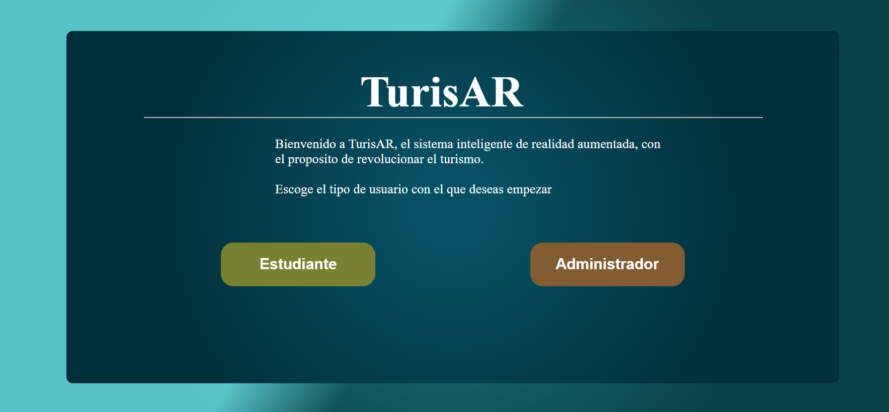

- Iniciar sesión (solo administradores): Acceder al panel de administración.
- Estudiante

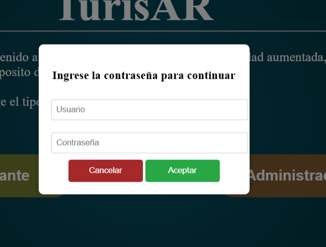

- Es necesario acceder con las credenciales: 
    - Usuario: admin
    - Contraseña: 1234

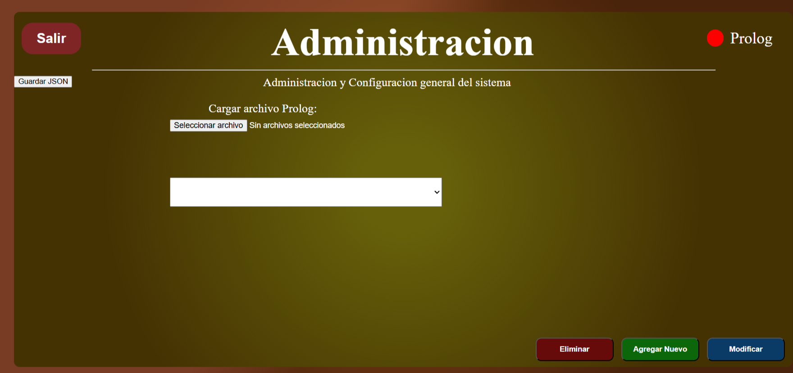

- Inicio del administrador
    - Agregar
    - Modificar
    - Eliminar
- Es necesario que deba cargar información primero para poder usar los botones de modificar y eliminar.

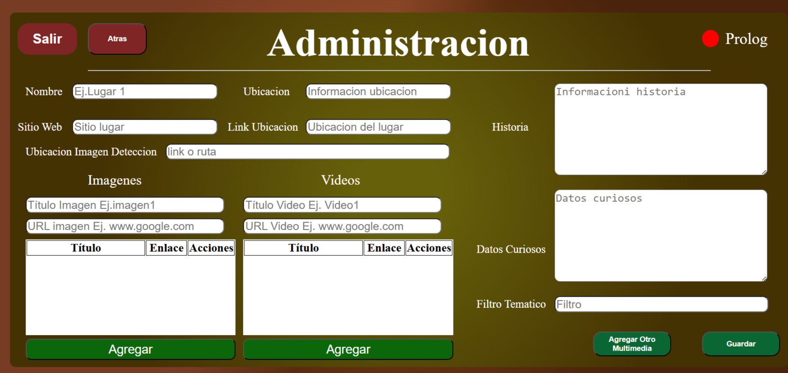

- Es necesraio llenar todos los campos correspondientes para poder agregar una ubicación, asi como se ve en la imagen siguiente.

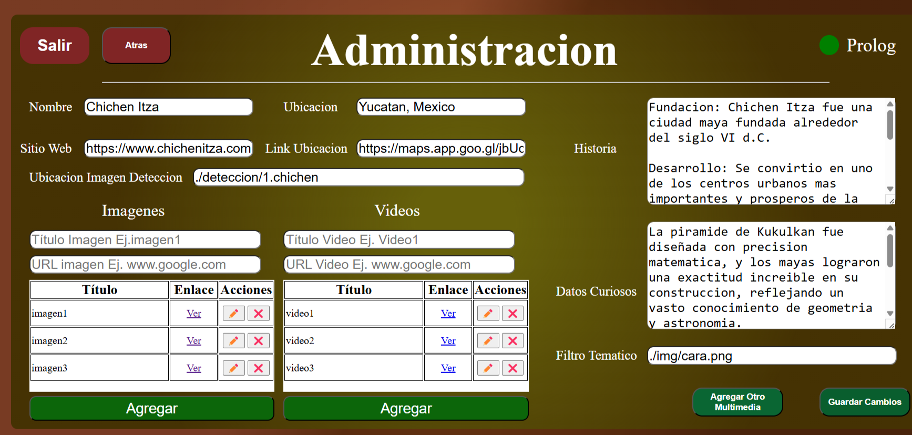

- Es necesario agregar la informacion que se quiere modificar y precionar el boton guardar cambios

### Nota 
Existen 2 formas de agregar datos: ingresando los datos manualmente o seleccionar un archivo.

## Interfaz del usuario
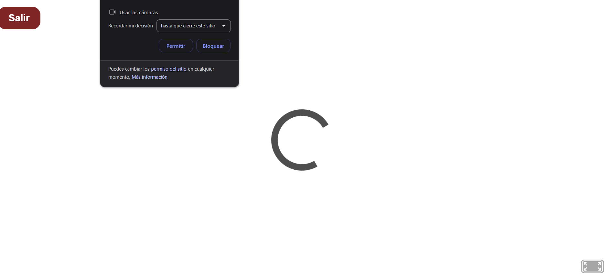

- Al ingresar como estudiante, aparecera una advertencia como la siguiente, es encesario darle acceso ya que utilizara la camara de la computadora, telefono o tablet.

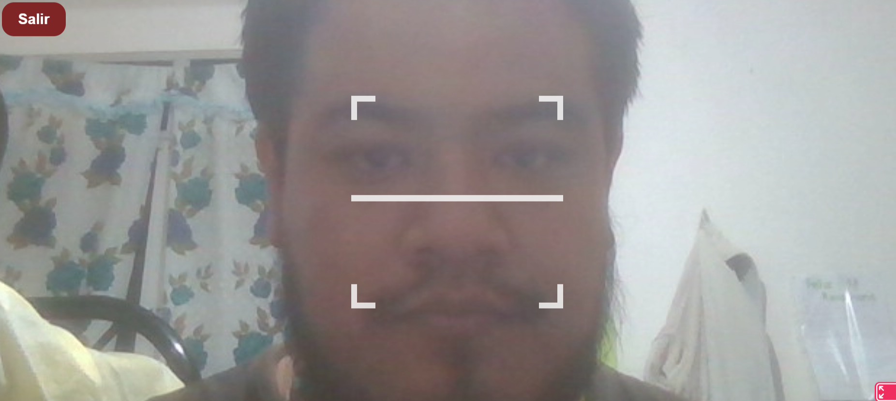

- Es encesario tener la imagen en el dispositivo para que aparezca el menu de nuestra aplicación, asi como la imagen siguiente.

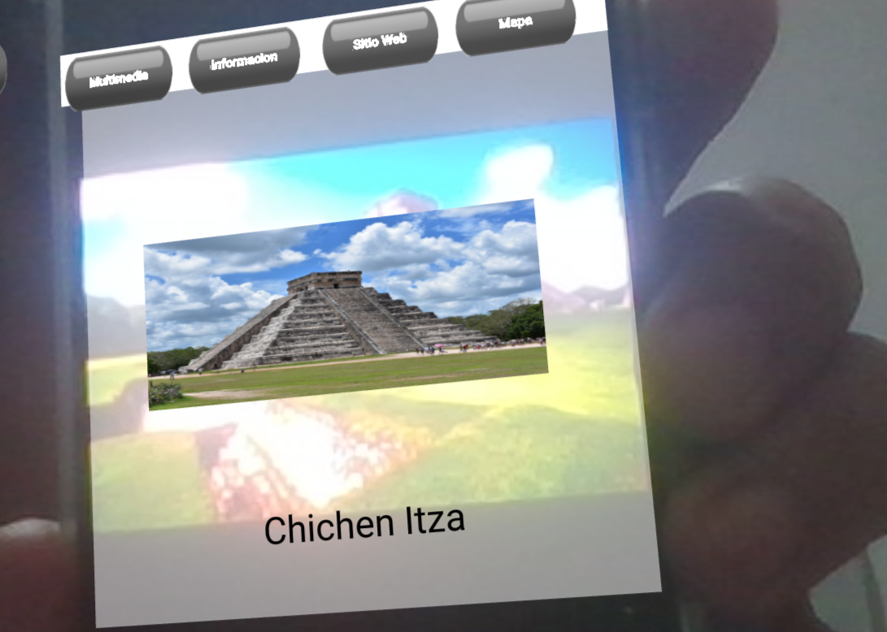

- Apareceran varias opciones, usted como usuario podra elegir entre las ocpiones cual le gustaria utilizar.

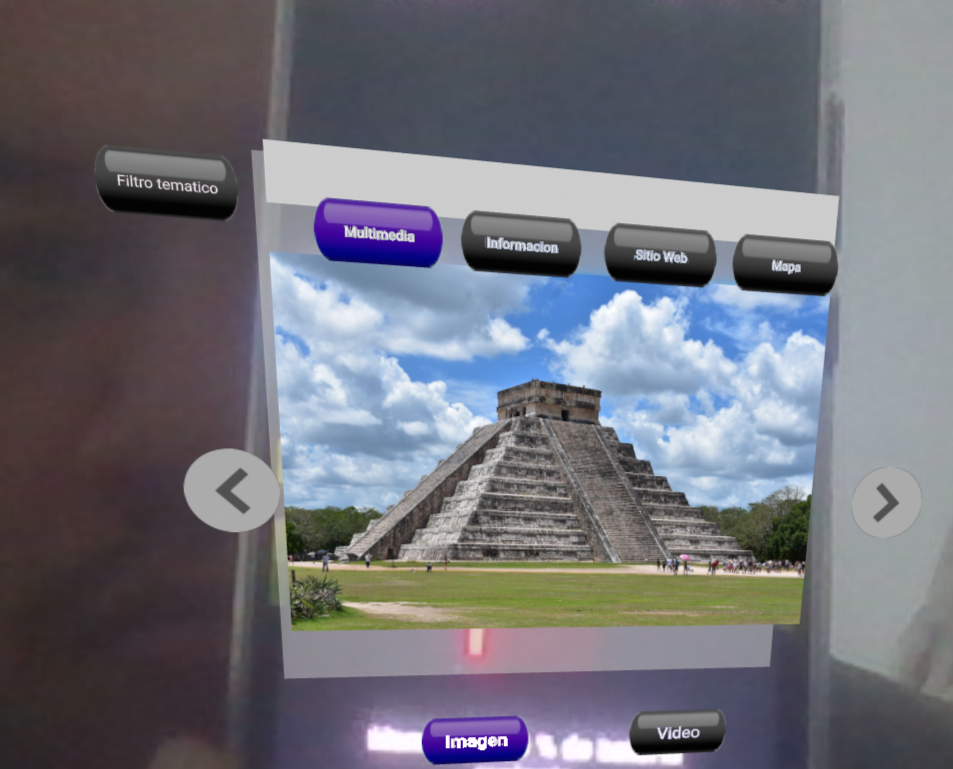

- Este es el de multimedia, apareceran varias fotos de la ubicación que eligio.

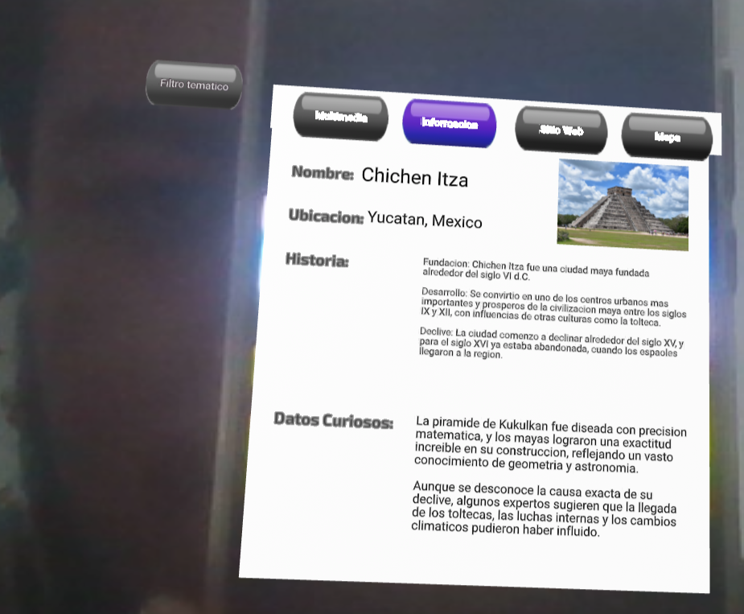

- Puede ver la informacion reelevante de la ubicación que usted eligio.
- En caso de que quiera ver un filtro tematico, es cuestion de darle a la opcion:Filtro tematico, para que le pueda aparecer como la siguiente captura.

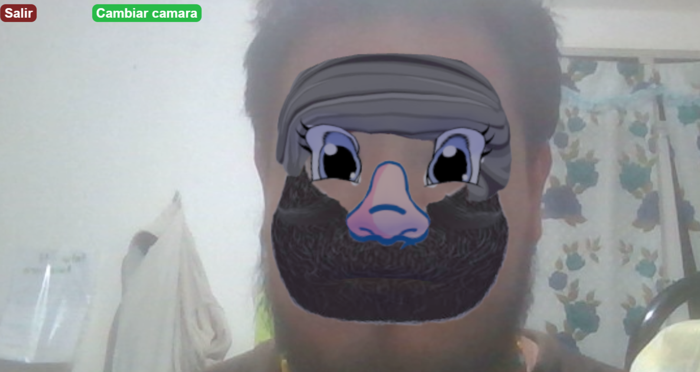